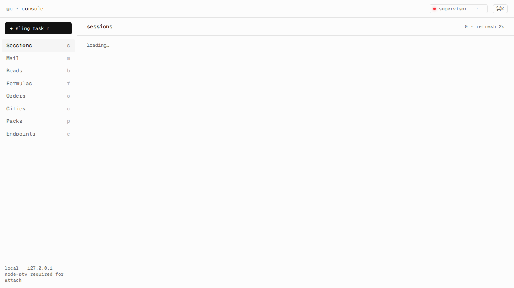
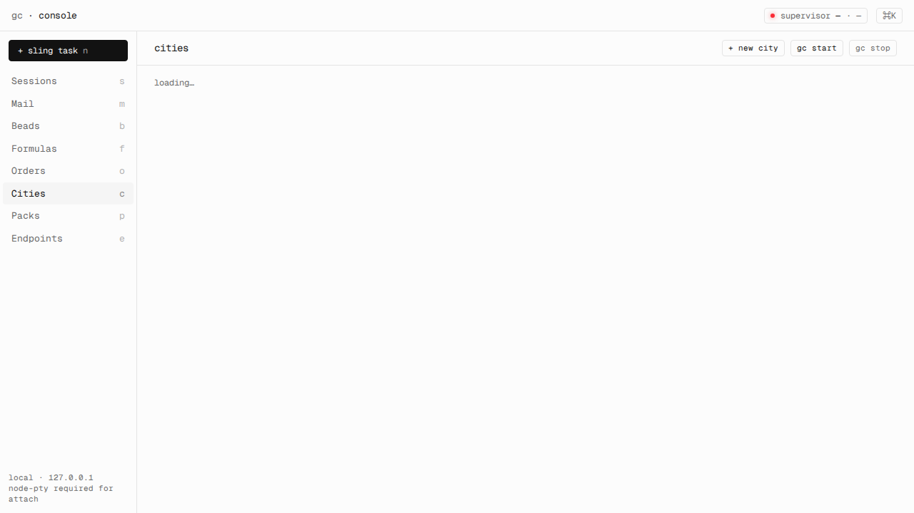
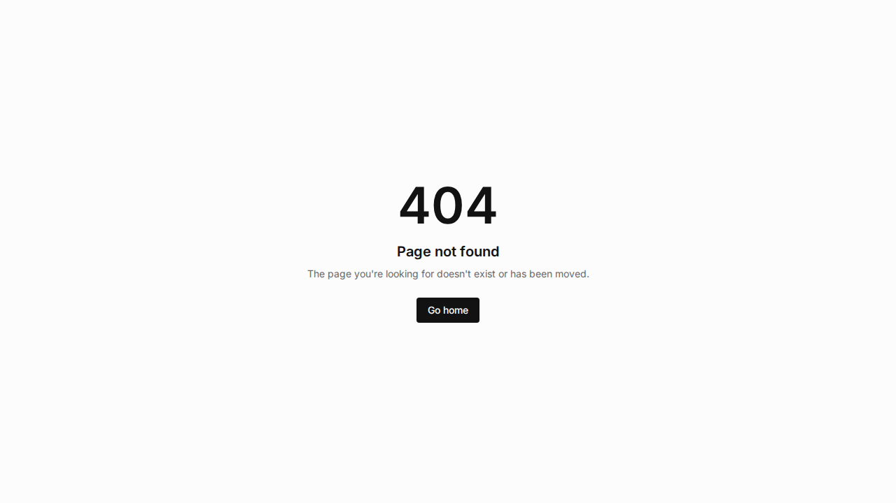

# gascity.ts - Interactive Guide

Welcome to the interactive guide for gascity.ts! This guide provides hands-on examples and visual walkthroughs.

## Table of Contents

- [Quick Start](#quick-start)
- [Console UI Tour](#console-ui-tour)
- [SDK Examples](#sdk-examples)
- [API Reference](#api-reference)
- [Advanced Patterns](#advanced-patterns)

## Quick Start

### Installation

```bash
# Install the SDK
bun add @gascity/client @gascity/sdk

# Or clone the repository
git clone https://github.com/gascity-extra/gascity.ts
cd gascity.ts
bun install
```

### Your First Task

```typescript
import { GasCityClient } from '@gascity/client';
import { slingTask } from '@gascity/sdk';

const client = new GasCityClient({
  baseUrl: 'https://api.gascity.com',
  token: 'your-api-token'
});

const result = await slingTask({
  client,
  agent: 'my-agent',
  city: 'my-city',
  task: 'Analyze this data'
});

console.log('Task completed:', result);
```

## Console UI Tour

The Gas City Console provides a modern interface for managing all your Gas City resources.

### Homepage



The homepage gives you quick access to all major features:
- **Cities** - Manage your Gas City instances
- **Agents** - View and configure AI agents
- **Tasks** - Track task progress and results
- **Sessions** - Interactive agent conversations

### City Management



Manage your Gas City instances with the Cities page:
- View all configured cities
- Create new cities
- Monitor city status
- Access city settings

### Agent Management


The Agents page provides:
- List of all available agents
- Agent capabilities and configuration
- Performance metrics
- Agent deployment status

### Task Tracking



Track your tasks with the Tasks page:
- View all active and completed tasks
- Monitor task progress in real-time
- Access task results and outputs
- Filter and search tasks

### Session Management


Manage interactive sessions:
- Start new conversations with agents
- View session history
- Monitor active sessions
- Access session transcripts

### Navigation


Quick navigation menu for easy access to all features.

## SDK Examples

### City Management

```typescript
import { initCity, startCity, stopCity } from '@gascity/sdk';

// Initialize a new city
const city = await initCity({
  client,
  cityName: 'my-city',
  config: {
    description: 'My development city',
    region: 'us-east-1'
  }
});

// Start the city
await startCity({
  client,
  cityName: 'my-city'
});

// Stop the city
await stopCity({
  client,
  cityName: 'my-city'
});
```

### Task Management

```typescript
import { slingTask, getTaskStatus, waitForTaskCompletion } from '@gascity/sdk';

// Submit a task
const bead = await slingTask({
  client,
  agent: 'my-agent',
  city: 'my-city',
  task: 'Analyze the sales data for Q4',
  metadata: {
    priority: 'high',
    department: 'sales'
  }
});

// Check status
const status = await getTaskStatus({
  client,
  city: 'my-city',
  beadId: bead.beadId
});

// Wait for completion
const result = await waitForTaskCompletion({
  client,
  city: 'my-city',
  beadId: bead.beadId,
  timeout: 300000 // 5 minutes
});
```

### Session Management

```typescript
import { createSession, interactSession } from '@gascity/sdk';

// Create a session
const session = await createSession({
  client,
  city: 'my-city',
  agent: 'my-agent',
  initialMessage: 'Help me analyze this data'
});

// Interact with the session
const response = await interactSession({
  client,
  city: 'my-city',
  agent: 'my-agent',
  sessionId: session.sessionId,
  message: 'What are the key trends?'
});
```

### Event Streaming

```typescript
import { streamEvents } from '@gascity/sdk';

// Stream events from a city
const eventStream = await streamEvents({
  client,
  city: 'my-city'
});

console.log('Listening for events...');

for await (const event of eventStream) {
  console.log('Event:', event.type, event.data);
  
  // Handle specific event types
  switch (event.type) {
    case 'task.created':
      console.log('New task created:', event.data.beadId);
      break;
    case 'task.completed':
      console.log('Task completed:', event.data.beadId);
      break;
    case 'agent.status':
      console.log('Agent status:', event.data.status);
      break;
  }
}
```

## API Reference

### GasCityClient

The main client for interacting with the Gas City API.

```typescript
import { GasCityClient } from '@gascity/client';

const client = new GasCityClient({
  baseUrl: string,      // API base URL
  token?: string,       // Authentication token
  timeout?: number,     // Request timeout (ms)
  headers?: Record<string, string> // Additional headers
});
```

### SDK Workflows

High-level workflows for common operations:

| Workflow | Description |
|----------|-------------|
| `initCity` | Initialize a new city |
| `startCity` | Start a city |
| `stopCity` | Stop a city |
| `slingTask` | Submit a task to an agent |
| `getTaskStatus` | Get task status |
| `waitForTaskCompletion` | Wait for task to complete |
| `createSession` | Create an interactive session |
| `interactSession` | Send message to session |
| `streamEvents` | Stream events from a city |

## Advanced Patterns

### Error Handling

```typescript
import { GasCityError, isGasCityError } from '@gascity/sdk';

try {
  const result = await slingTask({ /* ... */ });
} catch (error) {
  if (isGasCityError(error)) {
    console.error(`Gas City Error: ${error.message}`);
    console.error(`Code: ${error.code}`);
    
    // Handle specific error codes
    switch (error.code) {
      case 'CITY_NOT_FOUND':
        // Handle city not found
        break;
      case 'AGENT_UNAVAILABLE':
        // Handle agent unavailable
        break;
      default:
        // Handle other errors
    }
  }
}
```

### Retry Logic

```typescript
import { withRetry } from '@gascity/sdk';

const result = await withRetry(
  async () => client.someMethod(),
  {
    maxRetries: 3,
    delay: 1000,
    backoff: 'exponential'
  }
);
```

### Correlation Tracking

```typescript
import { generateCorrelationId } from '@gascity/sdk';

const correlationId = generateCorrelationId();

console.log(`Starting operation: ${correlationId}`);

try {
  const result = await slingTask({
    client,
    agent: 'my-agent',
    city: 'my-city',
    task: 'Analyze data',
    metadata: {
      correlationId
    }
  });
  
  console.log(`Operation completed: ${correlationId}`);
} catch (error) {
  console.error(`Operation failed: ${correlationId}`, error);
}
```

## Tips and Best Practices

### 1. Always Handle Errors

```typescript
// ✅ Good
try {
  const result = await slingTask({ /* ... */ });
} catch (error) {
  console.error('Task failed:', error);
}

// ❌ Bad
const result = await slingTask({ /* ... */ }); // No error handling
```

### 2. Use Timeouts

```typescript
// ✅ Good
const result = await waitForTaskCompletion({
  client,
  city: 'my-city',
  beadId: bead.beadId,
  timeout: 300000 // 5 minutes
});

// ❌ Bad
const result = await waitForTaskCompletion({
  client,
  city: 'my-city',
  beadId: bead.beadId
  // No timeout - could hang forever
});
```

### 3. Validate Inputs

```typescript
// ✅ Good
if (!cityName || !agentName) {
  throw new Error('City name and agent name are required');
}

const result = await slingTask({
  client,
  agent: agentName,
  city: cityName,
  task: taskText
});

// ❌ Bad
const result = await slingTask({
  client,
  agent: undefined, // Could fail
  city: undefined, // Could fail
  task: taskText
});
```

### 4. Use Correlation IDs

```typescript
// ✅ Good
const correlationId = generateCorrelationId();
const result = await slingTask({
  client,
  agent: 'my-agent',
  city: 'my-city',
  task: 'Analyze data',
  metadata: { correlationId }
});

// ❌ Bad
const result = await slingTask({
  client,
  agent: 'my-agent',
  city: 'my-city',
  task: 'Analyze data'
  // No correlation ID - hard to track
});
```

## Getting Help

- 📖 [Full Documentation](https://docs.gascity.com)
- 🐛 [Issues](https://github.com/gascity-extra/gascity.ts/issues)
- 💬 [Discussions](https://github.com/gascity-extra/gascity.ts/discussions)
- 📧 [Support](mailto:support@gascity.com)

## Next Steps

- Explore the [API Reference](../packages/@gascity/client/README.md)
- Learn about [SDK Workflows](../packages/@gascity/sdk/README.md)
- Check out the [Console UI](../packages/@gascity/console/README.md)
- Read the [Contributing Guide](../CONTRIBUTING.md)
